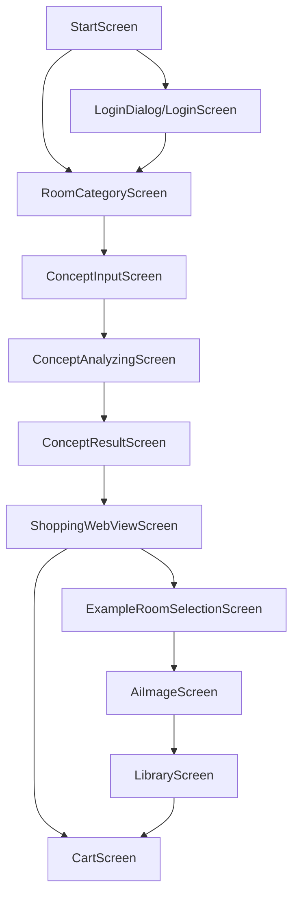

# RoomMade

RoomMade는 사용자의 감성/컨셉 텍스트를 분석해 인테리어 스타일을 추출하고, 추천 가구를 탐색/장바구니에 담은 뒤, 예시 룸 이미지를 기반으로 AI 인테리어 이미지를 생성·보관하는 Android 앱입니다.

## 화면 미리보기 (Screenshots)

아래 경로에 스크린샷을 추가하고, 필요하면 파일명(경로)을 원하는 대로 변경하세요.
- 권장 폴더: `docs/screenshots/`

### 로그인 화면


### 앱 시작 화면


### 감성 텍스트 입력 화면


### 감성 분석 화면


### 분석 결과 화면


### 추천 가구 쇼핑 화면


### 예시 이미지 선택 화면


### 이미지 생성 화면


### 보관함 화면


### 장바구니 화면


## 주요 기능

- Google 로그인(Firebase Auth) 기반 사용자 세션
- 감성/스타일 텍스트 분석(TensorFlow Lite)
- 분석된 스타일 기반 가구 검색/추천(네이버 쇼핑 검색 백엔드 프록시)
- 예시 룸 이미지 선택 후 AI 인테리어 이미지 생성(백엔드 호출)
- 생성 결과 보관함(Firestore) 및 이미지 저장/공유
- 장바구니(세션별 묶음) 관리

## 기술 스택

- Language: Kotlin
- UI: Jetpack Compose, Material 3, Navigation Compose
- Architecture: MVVM(ViewModel), Kotlin Coroutines/Flow
- Network/Image: OkHttp, Coil
- Firebase: Auth(구글), Firestore, Analytics
- ML/AI
  - On-device 텍스트 분석: TensorFlow Lite (`app/src/main/assets/interior_model.tflite`, `app/src/main/assets/vocab.txt`)
  - 이미지 생성: Cloud Run/Functions 엔드포인트(`IMAGE_GEN_FUNCTION_URL`) + 프롬프트 빌더
  - (옵션) Vertex AI Gemini 이미지 모델 호출 클라이언트(`app/src/main/java/com/example/roommade/network/VertexAiClient.kt`)

## AI 동작 개요

1. 사용자가 감성 텍스트 입력 → `ml/StyleAnalyzer`가 스타일 확률/태그 산출
2. 결과 태그 기반으로 가구 탐색 → `network/NaverShoppingClient`가 백엔드 함수로 검색
3. 예시 룸 이미지 선택 → base image(Data URI) 준비
4. 이미지 생성 → `domain/GenerationPromptBuilder`가 프롬프트 구성, `FirebaseImageGenClient`가 백엔드로 요청
5. 결과 저장 → Firestore(`users/{uid}/boards`)에 보관함 저장 및 갤러리 저장/공유

## 시스템 아키텍처 (System Architecture)

RoomMade는 Android 클라이언트(Compose + MVVM)에서 감성 분석을 온디바이스(TFLite)로 수행하고, 이미지 생성/쇼핑 검색은 백엔드 함수(Cloud Run/Functions)로 위임합니다. 인증/보관함 데이터는 Firebase(Auth/Firestore)로 관리합니다.

```mermaid
flowchart LR
  subgraph App[Android App]
    UI[Compose UI]
    VM[ViewModels]
    ML[TFLite StyleAnalyzer]
    Domain[UseCase / PromptBuilder]
    Net[Network Clients]
    Repo[Repository]
    UI --> VM
    VM --> ML
    VM --> Domain
    VM --> Repo
    Domain --> Net
  end

  VM --> Auth[Firebase Auth]
  Repo --> DB[(Firestore)]
  Net --> ShopFn[Naver Shopping Function]
  Net --> ImgFn[Image Gen Function]
  ImgFn --> Model[Image Model (e.g. Gemini Image)]
  Net -. optional .-> Vertex[Vertex AI API (direct)]
```

## 사용자 플로우 (User Flow)

1. 앱 실행 → `StartScreen`
2. (필요 시) 로그인 → `LoginDialog/LoginScreen` → Firebase Auth
3. 방 카테고리 선택 → `RoomCategoryScreen`
4. 감성 텍스트 입력 → `ConceptInputScreen`
5. 감성 분석 진행/대기 → `ConceptAnalyzingScreen` → 결과 확인 → `ConceptResultScreen`
6. 추천 가구 탐색/선택 → `ShoppingWebViewScreen` (필터/장바구니)
7. 예시 이미지 선택 → `ExampleRoomSelectionScreen`
8. AI 이미지 생성/저장/공유 → `AiImageScreen`
9. 보관함에서 결과 관리 → `LibraryScreen` (Firestore 저장 데이터 조회/삭제)
10. 장바구니 확인/구매 링크 이동 → `CartScreen`



## 프로젝트 구조

```
app/
  src/main/java/com/example/roommade/
    ui/        # Compose 화면들 (Login, Start, Concept, Shopping, AI Image, Library, Cart ...)
    vm/        # ViewModels (FloorPlanViewModel, AiImageViewModel)
    ml/        # TFLite 기반 감성/스타일 분석 (StyleAnalyzer, Tokenizer)
    domain/    # 유스케이스/프롬프트 빌더 (GenerateRoomImageUseCase 등)
    network/   # 백엔드/외부 API 클라이언트 (FirebaseImageGen, NaverShopping, VertexAI)
    data/      # Repository (FirestoreBoardRepository)
    model/     # 도메인 모델 (FloorPlan, Furniture, Recommendation 등)
    auth/      # 인증 (AuthViewModel)
    nav/       # 라우트/하단탭
    util/      # 이미지/비트맵 유틸
  src/main/assets/
    interior_model.tflite
    vocab.txt
```


